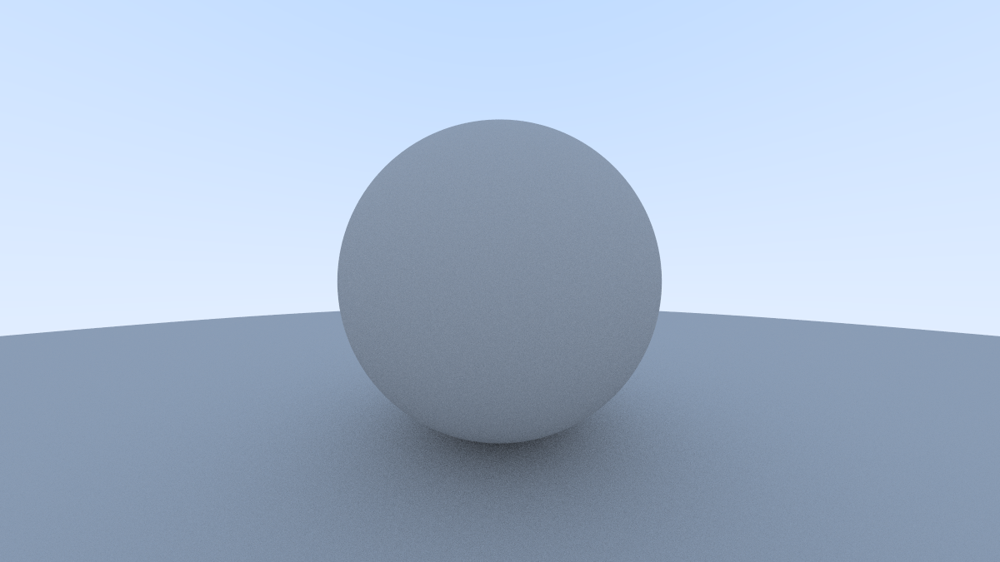
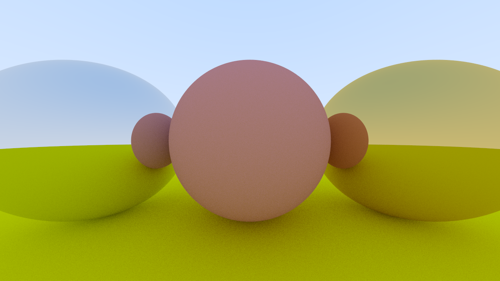
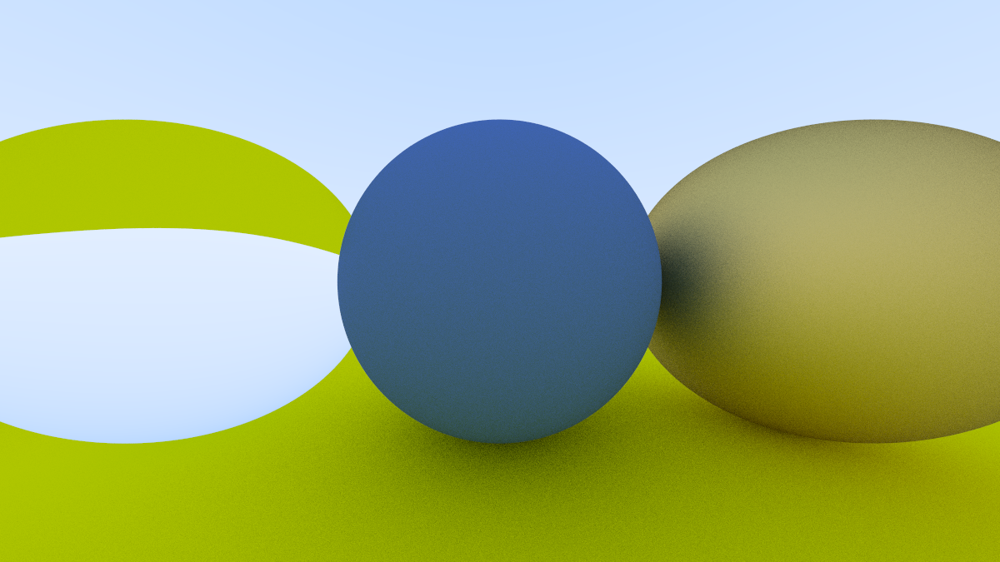
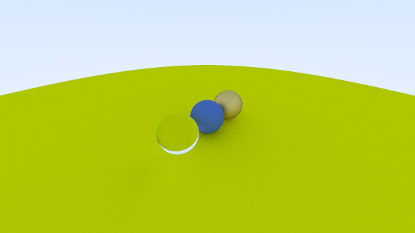
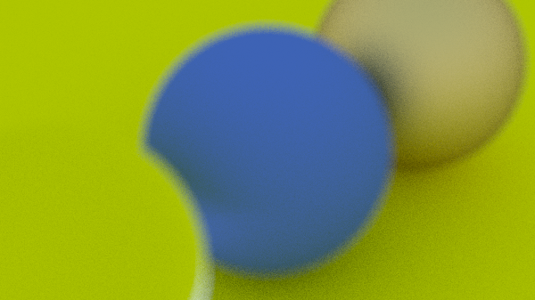

# Ray Tracing on One Weekend Pratice

 - [x] https://raytracing.github.io/books/RayTracingInOneWeekend.html
 - [ ] https://raytracing.github.io/books/RayTracingTheNextWeek.html

## init

```
sudo apt install imagemagick
g++ main.cpp -fopenmp
./a.out > a.ppm
convert a.ppm a.png
```

## image






